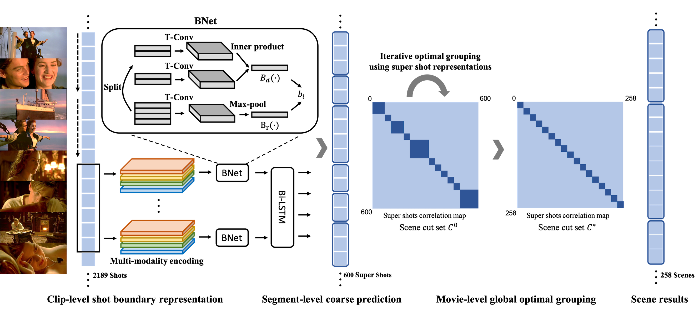

# SceneSeg LGSS
> Codebase for CVPR2020 A Local-to-Global Approach to Multi-modal Movie Scene Segmentation



## Introduction
From a video to segemented scenes. Basically, two steps are needed including holistic features extraction and temporal scene segmentation.

A single stage temporal scene segmentation is also provided in the [demo](docs/GETTING_STARTED.md#demo). This is going to be a easy-to-use tool for plot/story unstanding with scene as a semantic unit.
Currently, it only supports image input.

😬 The scene segmentation dataset is prompted to **[MovieNet](http://movienet.site)** project with 318 movies together with a easy-to-use toolkit. It is encouraged to use in the future. 

## Features
- Basic video processing tools are provided including [shot detection](pre/ShotDetection) and its parallel version.
- Holistic semantic video feature extractors including place, audio, human, action, speech are planned to be included if you wish and leave a looking forward message in the issue. Place and audio are supported now in the ``pre``. Full version is located at [movienet-tools](https://github.com/movienet/movienet-tools).
- All-in-one scene segmentation tool with all multi-modal multi-semantic elements.

## Notice 
😅 Since some enthusiastic researchers are requesting the codes but we plan to organize the codebase in an easy-to-use fashion, e.g. [movienet-tools]((https://github.com/movienet/movienet-tools)), we release an on-going version here.

## Installation
Please refer to [INSTALL.md](docs/INSTALL.md) for installation and dataset preparation. Pretrained models and dataset are also explanined here.

## Get Started
🥳 Please see [GETTING_STARTED.md](docs/GETTING_STARTED.md) for the basic usage.

## Citation
```
@inproceedings{rao2020local,
title={A Local-to-Global Approach to Multi-modal Movie Scene Segmentation},
author={Rao, Anyi and Xu, Linning and Xiong, Yu and Xu, Guodong and Huang, Qingqiu and Zhou, Bolei and Lin, Dahua},
booktitle={IEEE Conference on Computer Vision and Pattern Recognition (CVPR)},
year={2020}
}
```
